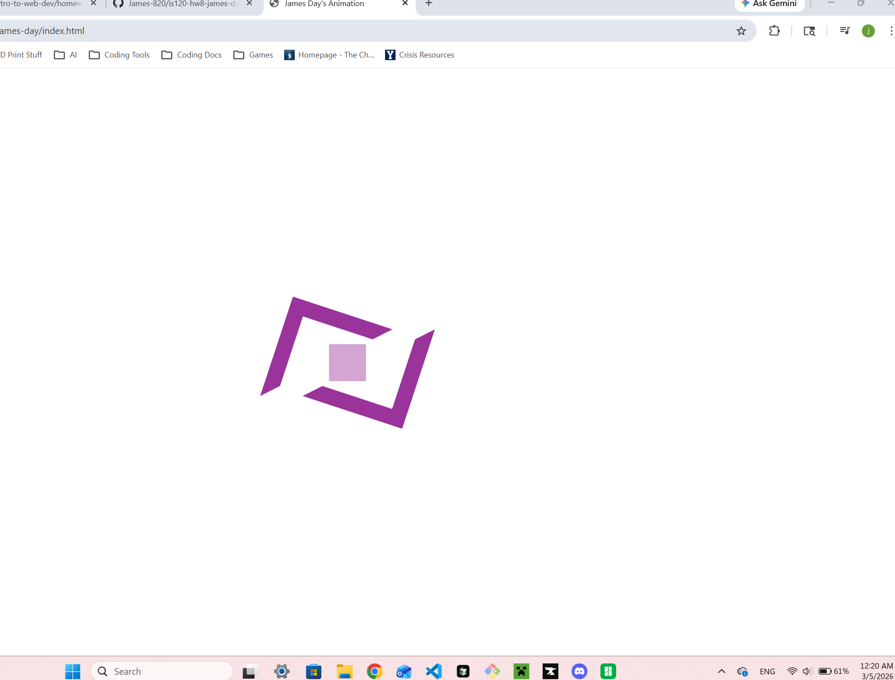
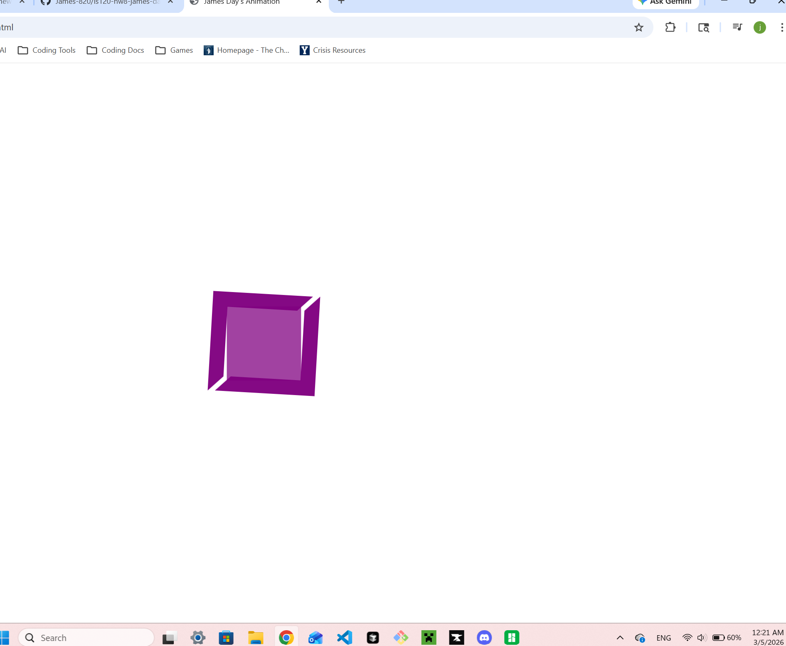

# IS 120, Homework 8 - James Day

HW8 of IS 120

## Requirements

- Use 3 `div` elements
- Should not loop, only trigger on load and stay at last frame
- Use the `transform` property

## Explanation

To get started, I saw the three `div` elements that were mentioned. Thanks to our experimentation during class, I knew that I could make the borders of a div look like that (the angled sections that rotate in). First, I got all the elements in their proper place, and I used test colors of red, green, and blue so I could tell them apart.

As I was coding, I tried to make the CSS as modular as possible. I added an "`animated`" class to each of the elements, and also a "`border`" class to the two border elements. That way, I wouldn't have to copy and paste the same code for each ID. Next, I started with the easiest of the animations, the middle square that grows to fill the other two. That was relatively simple after looking up MDN's `transform` docs.

Then I had to troubleshoot for a while with the next one. I decided to only focus on one element at a time, that way I wasn't changing two areas of code at the same time while I experimented to see what worked. I actually got hung up here for a bit, but soon found out that only one `animation` property is active at a time for an element, and that the `transform` property can take multiple functions.

Once I got the first border rotation down, I had an easy time doing the second one. Finally, I made them all the same color, slowed the animation way down for ease of screenshots, and after the screenshots, sped it back up.

## What Didn't Work

At first, the main thing that didn't work was the rotation and translation at the same time. I thought that the `transform` function only took one value, so I tried putting multiple `transform` properties onto the keyframes, but that didn't work. I even tried making another keyframe thingy altogether, but that also didn't work. It was only by reading the documentation that I discovered that the property could take multiple functions, and I finally got it to work.

Another thing that was tricky was getting the square to stay purple instead of reverting back to transparent. The reason I changed it to transparency for it's initial state was that with the animation delay, it would sit as a fully opaque, purple square, then disappear and begin growing. I figured out from the MDN docs that the `forward` keyword would make the styling "stick".

## Screenshots

As a side note, I read the "_throughout the development process_" phrase just now, so I totally misunderstood what you were asking for. I if you want different screenshots, please let me know and I can re-create what I had before.

